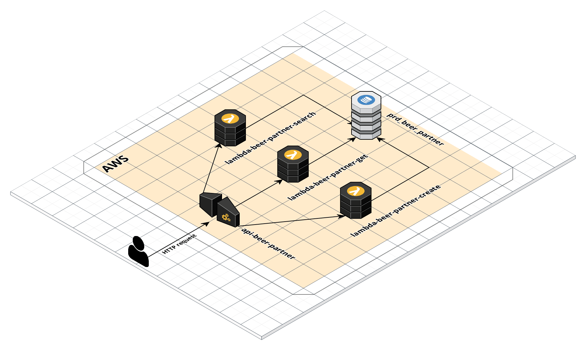
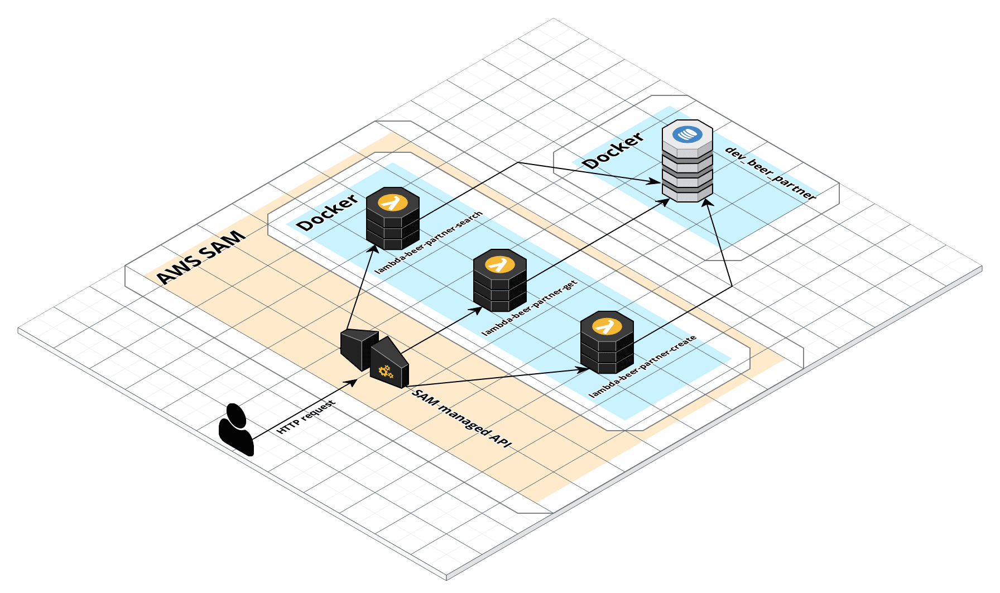

# Beer Partner :beers:
Encontre o parceiro mais próximo para comprar sua cerveja *geladinha* :snowflake:!

Pré-requisitos:
- [Git Bash][git_bash] (apenas se o SO for Windows)
- [.NET Core SDK (>= 3.1)][dotnet]
- [Docker][docker]
- [AWS CLI][aws-cli] (instalado e com perfil default [configurado][aws-cli-configuration])
- [AWS SAM (Serverless Application Model)][aws-sam]

## Comandos
Executar testes unitários e verificar coverage:
```bash
dotnet test -p:CollectCoverage=true
```

Subir API e banco de dados local:
```bash
./run-local.sh
```

Criar a stack na AWS e fazer deploy da aplicação:
```bash
./deploy-stack.sh
```

Destruir stack na AWS:
```bash
./destroy-stack.sh
```

Para testar as URLs localmente, disponibilizei uma collection do [Insomnia][insomnia] em "./src/automation/insomnia_collection/insomnia_beer_partner.json". Porém, caso prefira testar via cURL, as URLs locais são as seguintes:

- POST http://localhost:8080/partner
- GET http://localhost:8080/partner/{guid}
- GET http://localhost:8080/partner/search/{longitude}/{latitude}

Já as URLs da AWS, são impressas no shell ao final da execução do script ./deploy-stack.sh.

## Arquitetura da aplicação na AWS:


## Arquitetura da aplicação local:


## Checklist de aplicação
- [x] Aplicação feita para rodar na AWS
- [x] Microserviços feitos para rodarem como AWS Lambda
- [x] API REST através de AWS API Gateway
- [ ] Banco de dados DynamoDB (rodar em container para não depender da stack criada na AWS)
- [x] Rodar API local com SAM
- [ ] Documentar endpoints com Swagger
- [ ] Montar collection do Postman para testar endpoints
- [ ] Cross-plataform (testar local no Windows e no Linux)
- [x] ~~Criar stack na AWS através de CloudFormation~~ Criar stack na AWS com SAM
- [x] Montar scripts de criação da stack na AWS, deploy e destruição da stack
- [x] Criar implementação de GeoJSON
- [x] Testes unitários
- [x] Logs no CloudWatch
- [ ] Provisionar CLIs (dotnet, aws, sam) por container, para não precisar instalar tudo na máquina
- [x] Criar Json Custom Converter para GeoJSON
- [x] Completar API de create
- [x] Completar API de get by id
- [ ] Completar API de search by coordinates


[git_bash]: https://gitforwindows.org
[dotnet]: https://dotnet.microsoft.com/download
[docker]: https://www.docker.com
[aws-cli]: https://aws.amazon.com/cli/
[aws-sam]: https://aws.amazon.com/pt/serverless/sam/
[aws-cli-configuration]: https://docs.aws.amazon.com/cli/latest/userguide/cli-configure-files.html#cli-configure-files-methods
[insomnia]: https://insomnia.rest